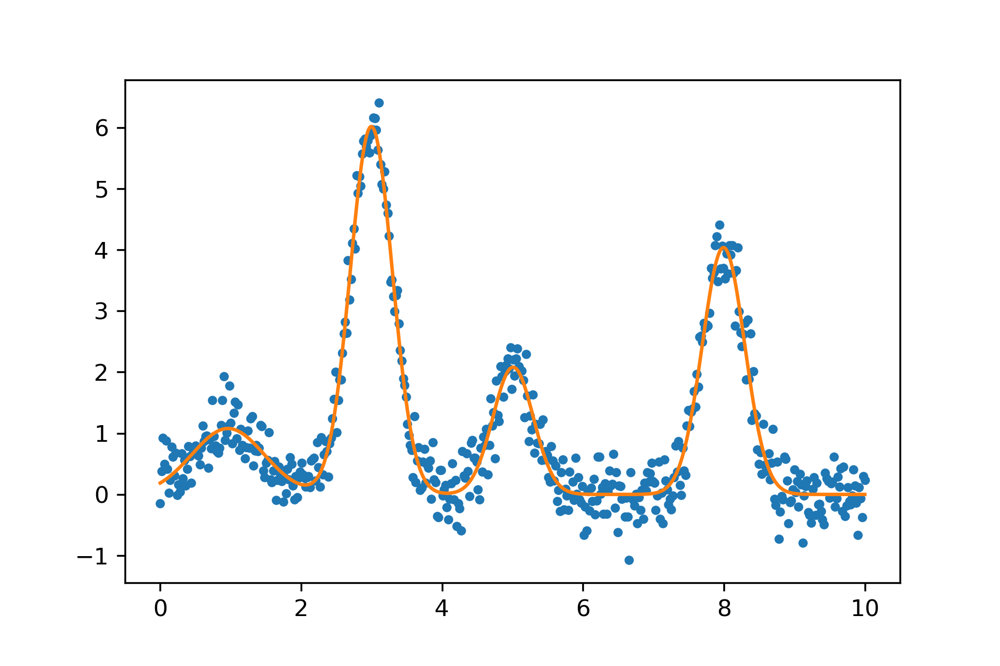

# Ambigauss

*Generic multi-peak fitter in Python*

Basic example:

```python
from ambigauss import gaussian, GaussianSpectrum

# Simulate noisy 4-peak spectrum
xdata = np.linspace(0, 10, 500)
ydata = gaussian(xdata, 1, 1, .5) + \
        gaussian(xdata, 2, 5, .3) + \
        gaussian(xdata, 6, 3, .3) + \
        gaussian(xdata, 4, 8, .3) + \
        np.random.randn(len(xdata))*.3 # Add noise


# Call fit function.
model = GaussianSpectrum(n_peaks=4).fit(xdata, ydata)

# Plot fitter results
xmodel = np.linspace(0,10, 1000)
ymodel = model.predict(xmodel)

plt.plot(xdata, ydata , '.')
plt.plot(xmodel, ymodel, '-')
model.parameters
```

```
Name              Value      Min      Max   Stderr     Vary     Expr Brute_Step
peak_0_center    0.9951     -inf      inf  0.03089     True     None     None
peak_0_height      1.02     -inf      inf   0.0554     True     None     None
peak_0_width     0.4925     -inf      inf  0.03225     True     None     None
peak_1_center     2.991     -inf      inf 0.004182     True     None     None
peak_1_height     5.963     -inf      inf  0.06855     True     None     None
peak_1_width     0.3145     -inf      inf 0.004203     True     None     None
peak_2_center     4.994     -inf      inf  0.01248     True     None     None
peak_2_height      1.96     -inf      inf  0.06964     True     None     None
peak_2_width     0.3041     -inf      inf  0.01248     True     None     None
peak_3_center     8.004     -inf      inf 0.006271     True     None     None
peak_3_height     3.903     -inf      inf  0.06957     True     None     None
peak_3_width     0.3047     -inf      inf 0.006271     True     None     None
```

## Install

Clone this repository and install a development version using `pip`:
```
pip install -e .
```
